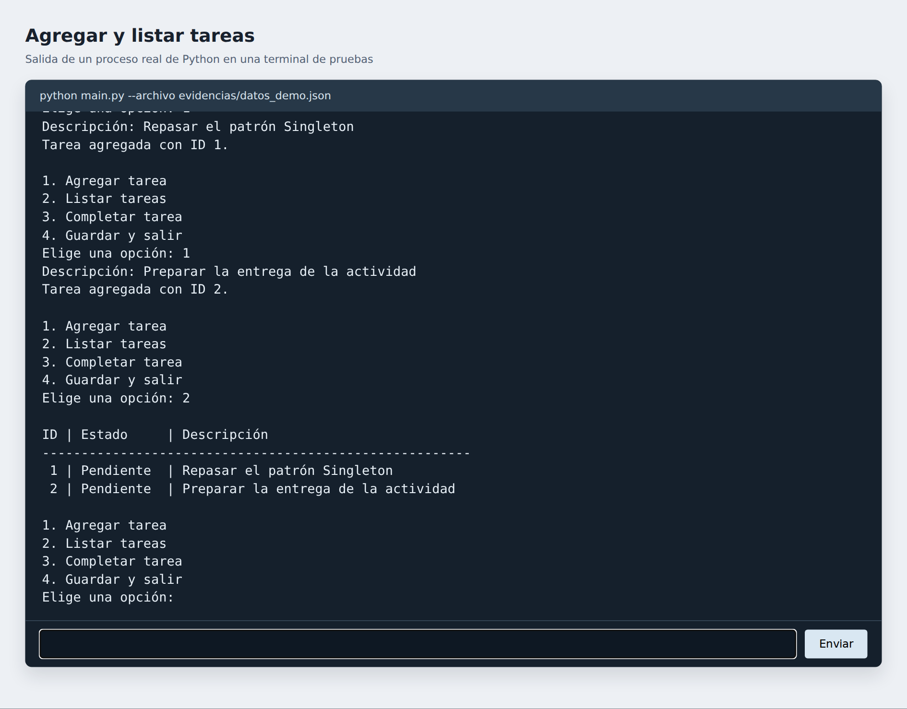
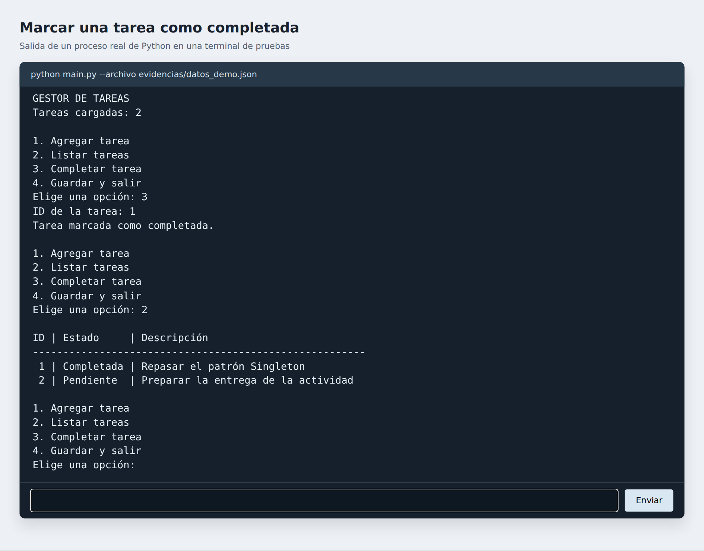
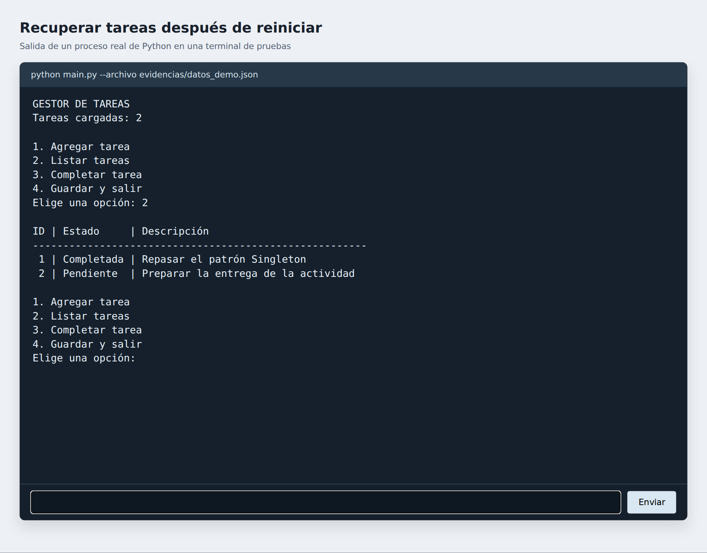
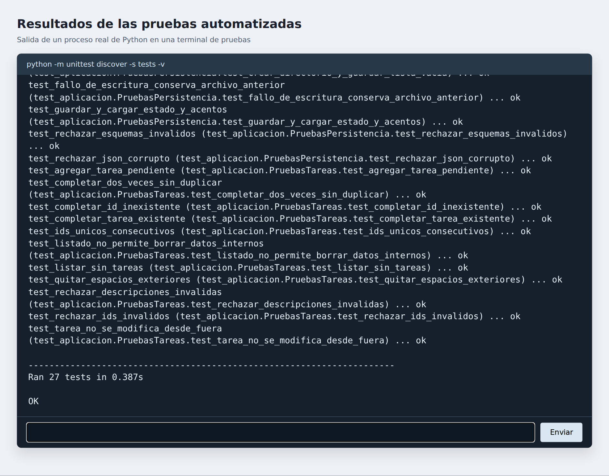

# Gestor de tareas en Python

**Autor:** Carlos Daniel Gómez González  
**Actividad 1:** Desarrollo y gestión de una aplicación de tareas

Desarrollé una aplicación de consola para registrar pendientes y marcarlos como
completados. Organicé la configuración con Singleton, guardé las tareas en JSON
y comprobé su funcionamiento con pruebas automatizadas de unittest.

## Funcionalidades

- Agregar tareas con ID único y estado pendiente.
- Listar todas las tareas con ID, descripción y estado.
- Marcar una tarea como completada usando su ID.
- Compartir la configuración mediante una sola instancia.
- Cargar automáticamente el JSON al iniciar y guardar antes de salir.
- Guardar después de agregar o completar desde el menú.
- Validar descripciones, identificadores y estructura del JSON.
- Informar errores sin sobrescribir un JSON inválido.
- Activar diagnósticos con `--debug`.

## Requisitos y ejecución

Python 3.10 o posterior. La aplicación y las pruebas utilizan únicamente
la biblioteca estándar; no necesitas instalar paquetes con pip.

Abre una terminal dentro de la carpeta del proyecto. En Windows ejecuta:

```powershell
py main.py
```

En Linux o macOS:

```bash
python3 main.py
```

Si tu instalación usa `python`, ejecuta `python main.py`.
El menú ofrece agregar, listar, completar y guardar y salir. Para completar una
tarea escribe el ID que aparece al listar.

## Configuración Singleton

`Configuracion` está en `gestor/configuracion.py`. `__new__` crea la instancia
una sola vez y las llamadas posteriores devuelven ese mismo objeto. Los valores
de `debug` y `archivo_tareas` se inicializan solo al crear la instancia.

```python
from gestor.configuracion import Configuracion
primera = Configuracion()
segunda = Configuracion()
print(primera is segunda)  # True
```

Esta implementación se utiliza en una aplicación de un solo proceso y un solo
hilo. Las tareas pertenecen a `GestorTareas`; Singleton comparte la configuración.

Para activar diagnósticos o abrir un archivo diferente:

```powershell
py main.py --debug
py main.py --archivo ejemplos/tareas_ejemplo.json
```

El segundo comando abre y modifica el archivo de ejemplo si realizas cambios.

## Persistencia JSON

Por defecto se utiliza `data/tareas.json` dentro del proyecto. La ruta se calcula
desde el código, por lo que también funciona si ejecutas main.py desde otra carpeta.

```json
[
  {
    "id": 1,
    "descripcion": "Repasar el patrón Singleton",
    "completada": true
  }
]
```

Si el archivo no existe, el programa inicia vacío y crea el directorio al guardar.
Si está dañado o contiene campos incorrectos, informa el error y se detiene sin
modificarlo. Los nuevos ID continúan después del mayor ID guardado.

Para guardar se escribe un archivo temporal en el mismo directorio y después
se reemplaza el archivo anterior. Si falla el reemplazo, se conserva el contenido
anterior. Los cambios del menú se guardan después de agregar o completar.
La opción 4, Ctrl+C y el fin de entrada ejecutan un guardado antes del cierre.
Los errores de disco se informan y devuelven un código de error.

La aplicación está pensada para una sola sesión por archivo. Un cierre forzado
no permite ejecutar el guardado final, aunque las operaciones del menú ya se
guardan después de cada cambio.

## Pruebas y resultados

```powershell
py -m unittest discover -s tests -v
```

En Linux/macOS sustituye `py` por `python3`.

Se ejecutaron **27 pruebas**, todas con resultado **OK**, en Python 3.12.14.
El tiempo puede variar entre equipos. Se utilizan directorios temporales para
no modificar las tareas del usuario.

| Grupo | Casos | Comportamiento verificado |
| --- | ---: | --- |
| Configuración | 2 | Instancia única y valores compartidos |
| Tareas | 11 | Agregar, listar, completar y validar datos |
| Persistencia | 7 | Carga, guardado, acentos y protección ante errores |
| Consola | 7 | Flujo completo, reinicio, cierre y diagnósticos |
| Total | 27 | Todas las pruebas pasaron |

Consulta la salida completa en [resultados_pruebas.txt](evidencias/resultados_pruebas.txt).

## Evidencias de funcionamiento

Las imágenes son capturas de una terminal de pruebas conectada al proceso real
de Python. La ventana permite introducir datos y observar la salida; la aplicación
entregada se utiliza desde la consola del equipo. Las sesiones completas con
las entradas utilizadas están en los archivos TXT de evidencias.

### Agregar y listar tareas



### Completar una tarea



### Recuperar tareas después de reiniciar



### Pruebas automatizadas



## Organización

| Archivo o carpeta | Función |
| --- | --- |
| `main.py` | Menú, argumentos y manejo del cierre |
| `gestor/configuracion.py` | Configuración Singleton |
| `gestor/tareas.py` | Modelo y operaciones de las tareas |
| `gestor/persistencia.py` | Lectura y guardado JSON |
| `tests/test_aplicacion.py` | Pruebas con unittest |
| `ejemplos/` | JSON de ejemplo |
| `evidencias/` | Capturas, sesiones, datos de demostración y resultados |
| `docs/` | Reporte editable |
| `PUBLICAR_GITHUB.md` | Pasos para publicar conservando los commits |

## Control de versiones

El repositorio incluye seis commits correspondientes a estas etapas:

1. Inicialización del proyecto y estructura básica.
2. Implementación del patrón Singleton.
3. Funciones para agregar, listar y completar tareas.
4. Persistencia JSON, carga automática y validaciones.
5. Pruebas unitarias y de integración con unittest.
6. Documentación del proyecto y evidencias de funcionamiento.

Consulta el historial con `git log --oneline --reverse`.
Los datos de `data/` y la caché de Python se excluyen mediante `.gitignore`.
El JSON de demostración se incluye para revisar las evidencias.

## Publicación y entrega

Sigue [PUBLICAR_GITHUB.md](PUBLICAR_GITHUB.md) para subir este repositorio a
tu cuenta y compartir la URL. No reinicies el historial que ya está creado.

## Referencias

Python Software Foundation. (s. f.). *Data model*. https://docs.python.org/3/reference/datamodel.html

Python Software Foundation. (s. f.). *json — JSON encoder and decoder*. https://docs.python.org/3/library/json.html

Python Software Foundation. (s. f.). *unittest — Unit testing framework*. https://docs.python.org/3/library/unittest.html

GitHub. (s. f.). *Adding locally hosted code to GitHub*. https://docs.github.com/en/migrations/importing-source-code/using-the-command-line-to-import-source-code/adding-locally-hosted-code-to-github
